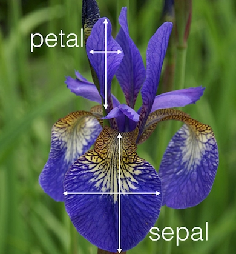

```{r global_options, include=T, echo = F}
knitr::opts_chunk$set(echo = T, warning=FALSE, message=FALSE)
```

# Introduction 

Data collected by  Edgar Anderson to quantify the morphologic variation of Iris flowers of three related species

It consists of 150 Iris flowers of three different species: setosa, versicolor, virginica

Four types of measurements for each flower, the length and width of sepals and petals in centimeters, respectively

Used by Ronald Fisher in 1936

<br>

<center>

</center>

<br>


### The dataset  
  
```{r}
library(MASS)
library(e1071) 
library(VGAM)
library(tidyverse)

head(iris)
```


### The goal

Based on the combination of the four features, Fisher developed a linear discriminant model (**LDA**) to distinguish the species from each other

# Classifiers in 1D

Let's try first classifiers in 1D:

```{r}
# type here any simple idea to classify flowers using only one variable
plot(iris$Sepal.Length,iris$Species)
```


```{r}
ggplot(iris, aes(y = Sepal.Length))+ geom_boxplot(aes(fill = Species))+ theme_minimal()
```

If the sepal length is 7, we see clearly that it is virginica. However, if it is 6.5 it is more complex.


```{r}
#Not that helpful as the previous ones.
ggplot(iris, aes(x = Sepal.Length, fill = Species)) + geom_density(alpha = 0.5, color = "black") + scale_fill_manual(values = c("red", "green", "blue"))
```


# Classifiers in 2D

Let's try now classifiers in 2D:


```{r}
# type here any simple idea to classify flowers using two variables
ggplot(iris, aes(x = Sepal.Width, color = Species)) + geom_boxplot() + theme_minimal()
```


```{r}
colours.iris=c('blue','green','orange')[iris[,5]]
pairs(iris[1:4],main='Iris data set',pch=19,col=colours.iris,lower.panel=NULL)
```


Insights?

Can we do it better?

# Bayes Classifiers

These classifiers work in high dimension, 4 in our case

## QDA

```{r}
qda.class.Iris <- qda(Species ~ ., iris)
qda.class.Iris
```

Exploratory graph for QDA:

```{r}
library(klaR)
partimat(Species ~ ., data=iris, method="qda")
```

Note the shapes are ellipsoids because the classifiers are quadratic

## LDA

```{r}
# guess here how to train LDA
lda.class.Iris <- lda(Species~.,iris)
lda.class.Iris
```

Note there are two linear classifiers because we have 3 groups

Exploratory Graph for LDA:

```{r}
partimat(Species~.,data=iris,method='lda')
```

Note the shapes are linear

# Predictions

The predictions are posterior probabilities, one probability for each category (species)

For QDA:

```{r}
post.prob.qda = predict(qda.class.Iris, iris)$posterior
head(post.prob.qda)
```

This computes the probability that each flower is one of the 3 types. The first are very straight forward because the probability of being setosa is 1 and the others 0, so it clearly is setosa. However, if we have probabilities 0.3, 0.5 and 0.2 we have to choose and we choose the highest one (the Bayes rule).

For LDA:

```{r}
post.prob.lda = predict(lda.class.Iris, iris)$posterior
head(post.prob.lda)
```

How to transform probabilities into labels?


```{r}
pred.qda = predict(qda.class.Iris, iris)$class
head(pred.qda)

pred.lda = predict(lda.class.Iris, iris)$class
head(pred.lda)
```

Scatterplot with predictions: good classifications in red and bad classifications in black

QDA:

```{r}
colors.qda.iris.good.bad <- c("black","red")[1*(iris[,5]==pred.qda)+1]
pairs(iris[,1:4],main="Bad (in black) classifications for Iris flowers with QDA",pch=19,col=colors.qda.iris.good.bad,lower.panel=NULL)
```

LDA:

```{r}
colors.lda.iris.good.bad <- c("black","red")[1*(iris[,5]==pred.lda)+1]
pairs(iris[,1:4],main="Bad (in black) classifications for Iris flowers with LDA",pch=19,col=colors.lda.iris.good.bad,lower.panel=NULL)
```

# Performance measures

Summarize accuracy (confusion matrix)

QDA: 

```{r}
confMat.qda = table(pred.qda,iris$Species)
confMat.qda
```


```{r}
n=dim(iris)[1]
error.qda=(n-sum(diag(confMat.qda)))/n
error.qda
```


LDA: 

```{r}
confMat.lda = table(pred.lda,iris$Species)
confMat.lda
```


```{r}
n=dim(iris)[1]
error.lda=(n-sum(diag(confMat.lda)))/n
error.lda
```


So, which is better, QDA or LDA? 

Both, because they have the same error.


Remember classifiers "live" in 4D: hence good performance

But can we trust these small errors?

I.e. if we would have 100 new flowers, the error would be again 2%?


# Leave-one-out cross-validation

```{r}
auxTrue = 0
for(i in 1:n){
  
  # Estimation: use all data except i-th
  lda.class.Iris <- lda(Species ~ ., iris[-i,])
  
  # Prediction: use just observation i-th
  pred = predict(lda.class.Iris, iris[i, ])$class
  
  # true labels
  true = iris$Species[i]
  
  if (pred==true) auxTrue = auxTrue + 1
}
```

CV errors:

```{r}
prop.errors <- (n - auxTrue) / n
prop.errors
```

CV is indeed coded inside LDA (no need of previous loop):

```{r}
lda.class.Iris <- lda(Species ~ ., iris, prior = c(1,1,1)/3, CV=TRUE)

ConfMat = table(iris[,5], lda.class.Iris$class)
ConfMat
```

```{r}
prop.errors <- (n - sum(diag(ConfMat))) / n
prop.errors
```

In this case the CV error is the same as the training error. But in practice it is not the same...

# Errors with training and testing sets

Here we consider QDA, LDA and Naive Bayes

We need to repeat the following many times (first try without the "for"):

```{r}
err.out=matrix(NA,nrow=100,ncol=3)
for(i in 1:100){
  train <- sample(1:150, 150*0.8)  # 80% of the sample for training
  n.test = 150*0.2
  table(iris$Species[train])   # this is the training set
  # note proportions change
  # this is why it's convenient to assign equal prior probabilities,
  # unless we have better prior knowledge...
  
  # train
  lda.class <- lda(Species ~ ., iris, subset = train)
  qda.class <- qda(Species ~ ., iris, subset = train)
  naive.class <- naiveBayes(Species ~ ., iris, subset = train)
  
  # predict
  pred.lda = predict(lda.class, iris[-train, ])$class
  pred.qda = predict(qda.class, iris[-train, ])$class
  pred.naive = predict(naive.class, iris[-train, ])
  
  # test
  ConfMat.lda = table(pred.lda, iris$Species[-train])
  err.lda <- (n.test - sum(diag(ConfMat.lda))) / n.test
  ConfMat.qda = table(pred.qda, iris$Species[-train])
  err.qda <- (n.test - sum(diag(ConfMat.qda))) / n.test
  ConfMat.naive = table(pred.naive, iris$Species[-train])
  err.naive <- (n.test - sum(diag(ConfMat.naive))) / n.test
  
  err.out[i,1] <- err.lda
  err.out[i,2] <- err.qda
  err.out[i,3] <- err.naive
  
  }
```

```{r}
boxplot(err.out,col="blue",xlab="", ylab="testing error", names=c("lda","qda","naive"))
```

Average error in the testing set

```{r}
apply(err.out,2,mean)
```

Naive Bayes is the worst and lda the best because it has the lowest testing error mean.
