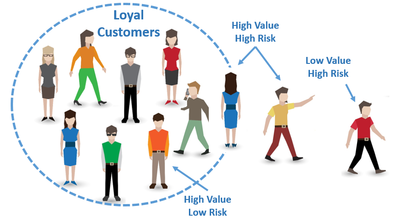

```{r global_options, include=T, echo = F}
knitr::opts_chunk$set(echo = T, warning=FALSE, message=FALSE)
```

# Motivation

Customer churn: a customer (player, subscriber, user, etc.) ends his or her relationship with a company

High cost of churn for telco and banking companies: lost revenue and marketing costs involved with replacing those customers with new ones (who are difficult to gain)

It is more difficult and expensive to acquire a new customer than it is to retain a current one

Hence, reducing churn is a key business goal for many companies

In this case study, our **objective** will be to predict customer churn in a Telco company while explaining what features relate to customer churn, i.e. the company needs to understand who is leaving and why

Moreover, we will predict whether is at a high risk of churning and who are customers providing more income to the company than others: **risk learning**

<center></center>

<br>

### Available Data

Dataset from IBM Watson Telco Dataset: <https://www.ibm.com/communities/analytics/watson-analytics-blog/guide-to-sample-datasets/>

This telco company is concerned about the number of customers leaving their landline business for cable competitors

### Load useful libraries

```{r}
library(tidyverse)
library(skimr)
library(forcats)
library(VIM)
library(GGally)
library(MASS)
library(caret)
library(randomForest)
library(gbm)
library(neuralnet)
```

# Load and explore the data set

```{r}
churnData <- read.csv('ChurnData.csv', stringsAsFactors=T)

glimpse(churnData)
```

The dataset includes information about:

-   Customers who left within the last month: The column is called Churn

-   Services that each customer has signed up for: phone, multiple lines, internet, online security, online backup, device protection, tech support, and streaming TV and movies

-   Customer account information: how long they have been a customer, contract, payment method, paperless billing, monthly charges, and total charges

-   Demographic info about customers: gender, age range, and if they have partners and dependents

Summary:

```{r}
summary(churnData)
```

### Some exploratory analysis

```{r}
aggr(churnData, numbers = TRUE, sortVars = TRUE, labels = names(churnData),
     cex.axis = .5, gap = 1, ylab= c('Missing data','Pattern'))
```

11 NAs in TotalCharges, what to do?
Since there are only 11 observations with missing values out of 7043, it is safe to delete them. Another good option would be to use the median, which might be better than the mean since this variables is asymmetric. It would also be possible to use the library `mice`, which imputes the missing values with the conditional mean of the column.

```{r, include=F}
# remove observations with NA
churnData = na.omit(churnData)
```

Make some descriptive analysis

```{r}
# Insert your code here
barplot(table(churnData$Churn), main='Unbalanced Data?', col='maroon3')

prop.table(table(churnData$Churn))
```

26% of customers left the company in the last month

### Some feature engineering

We will change "No internet service to "No" for columns:

"OnlineSecurity", "OnlineBackup", "DeviceProtection", "TechSupport", "streamingTV", "streamingMovies"

Moreover, we will change "No phone service" to "No" for column "MultipleLines"

```{r, include=F}
for(i in c(9:14)) {
  churnData[,i] <- fct_collapse(churnData[,i], No = c("No","No internet service"))
}

churnData$MultipleLines <- fct_collapse(churnData$MultipleLines, No = c("No","No phone service"))

churnData = churnData[,-1]
```

# Data splitting

```{r}
in_train <- createDataPartition(churnData$Churn, p = 0.8, list = FALSE)  # 80% for training
training <- churnData[ in_train,]
testing <- churnData[-in_train,]
nrow(training)
nrow(testing)
```

## Some descriptive analysis using the training set

```{r}
# Insert your code here
ggplot(training, aes(MonthlyCharges)) + geom_density(aes(group=Churn, colour=Churn, fill=Churn), alpha=0.1) +xlab("Monthly charges")

ggplot(training, aes(tenure)) + geom_density(aes(group=Churn, colour=Churn, fill=Churn), alpha=0.1) + xlab("tenure")
```

Under ~40, most customers stay. Over ~70, most customer want to leave. In the range between those two, it is not so clear. This means that the company can focus on this range of values to tip the scales so that more customers might want to stay.

```{r}
# Insert your code here

# Categorical vs categorical
ggplot(training, aes(x=Churn, fill=Contract)) + geom_bar()

```

The main source of people who want to leave comes from those who have a month-to-month contract. That is, most people who leave, are those who can without a penalty. This shows that penalty is a powerful dissuasive. 

There are some variables with high correlations; should skip them

```{r, include=F}
training$TotalCharges = NULL
testing$TotalCharges = NULL

```

# The Benchmark

We have many predictors, hence our benchmark will be penalized logistic regression

```{r}
ctrl <- trainControl(method = "cv", number = 5,
                     classProbs = TRUE, 
                     verboseIter=T)

# We have many predictors, hence use penalized logistic regression (with elastic net, ridge+lasso)
lrFit <- train(Churn ~ ., 
               method = "glmnet",
               tuneGrid = expand.grid(alpha = seq(0, 1, 0.1), lambda = seq(0, .1, 0.02)),
               metric = "Kappa", # kappa is accuracy but incorporating the unbalance
               data = training,
               preProcess = c("center", "scale"),
               trControl = ctrl)
print(lrFit)
lrPred = predict(lrFit, testing)
confusionMatrix(lrPred, testing$Churn)
```

Accuracy around 80%, but not the best performance measure here. Why?

Kappa around 0.46, not bad but it should be improved


The most dangerous mistake is predicting a client will not leave when they will. This is the mistake that should be reduced.

What happens if we use another threshold in the Bayes's rule?

```{r}
threshold = 0.3
lrProb = predict(lrFit, testing, type="prob")
lrPred = rep("No", nrow(testing))
lrPred[which(lrProb[,2] > threshold)] = "Yes"
confusionMatrix(factor(lrPred), testing$Churn)
```

Note the trade-off between false negatives and false positives is much better, but also note accuracy and kappa have been worsened


### The ROC curve

ROC curve shows true positives vs false positives in relation with different thresholds:

-   y-axis = Sensitivity (TP)
-   x-axis = Specificity (1-FP)

The ROC:

```{r}
library(pROC)

bench.model = glm(Churn ~ 1, family=binomial(link='logit'), data=training)
prob.bench = predict(bench.model, newdata=testing, type="response")

roc.lr=roc(testing$Churn ~ lrProb[,2])
roc.bench=roc(testing$Churn ~ prob.bench)

plot(roc.lr, col="red",print.thres=TRUE)
plot(roc.bench, add=TRUE, col='green',print.thres=TRUE)
legend("bottomright", legend=c("lr", "bench"), col=c("red",  "green"), lwd=2)

roc.lr$auc
roc.bench$auc

```

The best threshold is that with the highest sum sensitivity + specificity

AUC = Area Under the Curve: around 0.85, the larger the better. Maximum is 1

Seems a threshold around 0.25 is reasonable for logistic regression

-   this is because classes are unbalanced

-   this is the threshold with the best balance between sensitivity and specificity

### Variable importance

For Bayes' classifiers or logistic regression, variable importance is based on estimated coefficients

```{r}
lr_imp <- varImp(lrFit, scale = F)
plot(lr_imp, scales = list(y = list(cex = .95)))
```

Insights?

### Partial dependence plots

These are the marginal effects of one variable after discounting for other variables

In linear models, they are lines (hyper-planes), like $\beta_1\cdot x_1$

```{r}
library(pdp)

partial(lrFit, pred.var = "tenure", which.class=2, plot = TRUE, prob=TRUE, rug = TRUE)
partial(lrFit, pred.var = "Contract",  which.class=2, plot = TRUE, prob=TRUE, rug = TRUE)
```

# Cost-sensitive learning

Features increasing chances of leaving:

-   Tenure (especially \< 12 Months)
-   Internet Service = Fiber Optic
-   Payment Method = Electronic Check

Features decreasing chances of leaving:

-   Contract = two ear
-   Total/monthly charges

Accuracy is ok, around 80%. But are the two errors equally important?

The company will be concerned with balancing:

-   the cost of a customer who is leaving and has not been targeted,

-   the cost of inadvertently targeting customers that are not planning to leave

Usually, the first cost (associated with false negatives) is the most dangerous for the company

Hence, how can we reduce that cost (at the expense of increasing the other cost)?

Assume the following (company's data):

-   Cost of true negatives is 0: the model is correctly identified a happy customer, no need to offer discounts

-   Cost of false negatives is 500 (customer value): most problematic error, we lose the customer

-   Cost of false positives is 100: retention incentive

-   Cost of true positives is 140: (1-gamma)\*(customer value) + gamma\*(retention incentive)

where gamma=probability a custommer accepts the incentive/offer, 0.9 in our case

Cost matrix:

| Prediction/Reference |  no | yes |
|----------------------|----:|----:|
| predicted no         |   0 | 500 |
| predicted yes        | 100 | 140 |

Unit cost is then:

0\*TN + 100\*FP + 500\*FN + 140\*TP

```{r}
# Type the unit cost here:

cost.unit <- c(0, 100, 500, 140)
```

### Cost of Naïve classifier

Unit cost for Naive classifier (no analytics knowledge)

cost = 0\*.74 + 100\*0 + 500\*.26 + + 140\*0 = 130eur/customer on average

Savings = (retention incentive - cost)

in the case of the naive classifier, the savings = -30eur/customer, i.e. a loss

Savings from the benchmark (that needs analytics knowledge)

```{r}
CM = confusionMatrix(factor(lrPred), testing$Churn)$table
cost = sum(as.vector(CM)*cost.unit)/sum(CM)
cost
```

Savings per customer around 20 eur, i.e. 50 eur better than the naive

## Cost-sensitive classifier (expert level)

```{r}
cost.i = matrix(NA, nrow = 100, ncol = 10)
# 20 replicates for training/testing sets for each of the 10 values of threshold

j <- 0
for (threshold in seq(0.05,0.5,0.05)){
  
  j <- j + 1
  cat(j)
  for(i in 1:100){
    
    # partition data intro training (75%) and testing sets (25%)
    d <- createDataPartition(training$Churn, p = 0.8, list = FALSE)
    # select training sample
    
    train <- churnData[d,]
    test  <- churnData[-d,]  
    
    lrFit <- train(Churn ~ ., data=train, method = "glmnet",
                   tuneGrid = data.frame(alpha = 0.3, lambda = 0), preProcess = c("center", "scale"),
                   trControl = trainControl(method = "none", classProbs = TRUE))
    
    lrProb = predict(lrFit, test, type="prob")
    lrPred = rep("No", nrow(test))
    lrPred[which(lrProb[,2] > threshold)] = "Yes"
    
    CM = confusionMatrix(factor(lrPred), test$Churn)$table
    cost = sum(as.vector(CM)*cost.unit)/sum(CM)
    cost
    
    cost.i[i,j] <- cost
    
  }
}

# Threshold optimization:
boxplot(cost.i, main = "Threshold selection",
        ylab = "unit cost",
        xlab = "threshold value",
        names = seq(0.05,0.5,0.05),col="royalblue2",las=2)

# values around 0.2 are reasonable
apply(cost.i, 2, median)
```

Savings around 20eur/customer on average

Can you imagine the savings with just 100,000 customers?

Final prediction:

```{r}
threshold = 0.2
lrFit <- train(Churn ~ ., data=training, method = "glmnet",
               tuneGrid = data.frame(alpha = 0.3, lambda = 0), preProcess = c("center", "scale"),
               trControl = trainControl(method = "none", classProbs = TRUE))
lrProb = predict(lrFit, testing, type="prob")
lrPred = rep("No", nrow(testing))
lrPred[which(lrProb[,2] > threshold)] = "Yes"
CM = confusionMatrix(factor(lrPred), testing$Churn)$table
cost = sum(as.vector(CM)*cost.unit)/sum(CM)
cost
```

# Risk learning

There are customers who provide more income to the company than others

Hence, we should focus on them if their churn probability is high

Money at risk:

```{r}
Risk.customer.year=testing$MonthlyCharges*lrProb[,2]*12
hist(Risk.customer.year,col="lightblue")
```

We should focus on customers with money.at.risk \> 500 eur

```{r}
sum(Risk.customer.year>500)/length(Risk.customer.year)
```

Around 20% of customers would incur high losses, but who are they?

```{r}
sort.risk = sort(Risk.customer.year,decreasing=T,index.return=T)

# Most risky positions:
head(sort.risk$x)
# Most risky customers:
head(sort.risk$ix)
```

We can then offer risky customers a discount or better service, etc.

# Machine Learning tools

## Random Forest

Using the `randomForest` library

```{r}
rf.train <- randomForest(Churn ~., data=training, ntree=200, mtry=10, cutoff=c(0.75,0.25), importance=TRUE, do.trace=T)

# mtry: number of variables randomly sampled as candidates at each split
# ntree: number of trees to grow
# cutoff: cutoff probabilities in majority vote
```

Although `caret` is easier and recommended, the original library `randomForest` allows for more custom modification. For example, in the original library, the parameter `cutoff`, which is not included in `caret`, indicates the threshold for the most voted category to be considered as such (which by default is c(0.5,0.5); the usual definition of the mode). In general, it is better to be more conservative.

Writing the formula using ~. is not recommended, in statistics since it might include non-important variables that might lead to overfitting or collinearity. In Machine Learning, specifically in Random Forest, this is not a problem.


Prediction:

```{r}
rf.pred <- predict(rf.train, newdata=testing)
confusionMatrix(rf.pred, testing$Churn)
```

The confusion matrix shows that there are many more cheap misclassifications than expensive ones. This is due to the `cutoff` parameter, which has been correctly balanced. Using the standard value of the parameter, the number of expensive mistakes greatly increases.

Let's optimize now the hyper-parameters using Caret with a specific customized loss.

Define first the specific function for the cost:

```{r}
EconomicCost <- function(data, lev = NULL, model = NULL) 
{
  y.pred = data$pred 
  y.true = data$obs
  CM = confusionMatrix(y.pred, y.true)$table
  out = sum(as.vector(CM)*cost.unit)/sum(CM)
  names(out) <- c("EconomicCost")
  out
}
```

Instead of cost, profit can also be considered; `caret` has options for both.

For example, this is the cost with the previous prediction

```{r}
EconomicCost(data = data.frame(pred  = rf.pred, obs = testing$Churn))

```

Now include this function in the Caret control:

```{r}
ctrl <- trainControl(method = "cv", number = 5,
                     classProbs = TRUE, 
                     summaryFunction = EconomicCost,
                     verboseIter=T)
```

Now train a RF using Caret with the specific metric:

```{r}
rf.train <- train(Churn ~., 
                  method = "rf", 
                  data = training,
                  preProcess = c("center", "scale"),
                  ntree = 200,
                  cutoff=c(0.7,0.3),
                  tuneGrid = expand.grid(mtry=c(6,8,10)), 
                  metric = "EconomicCost",
                  maximize = F,
                  trControl = ctrl)
```

There are two sets of hyperparameters, `ntree` and `cutoff`, and `mtry` within the `tuneGrid` argument. Inside the `train` function, `caret` considers them different groups. In `caret` there are some parameters that cannot be optimized, only the ones that are accepted with the `tuneGrid` argument and which are established in the source code of `caret` by the authors. The other parameters have to be hard-coded when using the `train` function. Sometimes, such as in this case, some important hyperparameters are left out of the hyperparameter tuning by `caret`. The only to tune these is by hand. 

Variable importance:

```{r}
rf_imp <- varImp(rf.train, scale = F)
plot(rf_imp, scales = list(y = list(cex = .95)))
```

The importance of these variables is different to those found with logistic regression. This is probably because the Random Forest model has found a non-linear relationship that logistic regression would never be able to obtain.

We can visualize this relation using the following code, from the library `pdp`.

```{r}
library(pdp)
partial(rf.train, pred.var = "tenure", which.class=2, plot = TRUE, prob=TRUE, rug = TRUE)
partial(rf.train, pred.var = "MonthlyCharges", which.class=2, plot = TRUE, prob=TRUE, rug = TRUE)
```

Clearly the relationship between `tenure` and the response is non-linear. Logistic regression was able to find the importance of this variable by using a straight line that best approximated this relation. 

The second most important variable is definitely non-linear as well, and in such a way that logistic regression could not approximate it well at all. 

(Interpretation of the professor for the relation of the second most important variable): there is a horizontal line until around 60€, meaning that if the customer is paying less than 60€ all the customer are happy, and there is a fixed probability of leaving. After 60€, there seems to be a positive linear slope, meaning that the more expensive the plan is after 60€, the customer believes it to be too expensive and is more likely to leave.

Prediction:
Using the predict function, the default threshold is 0.5.

```{r}
rfPred = predict(rf.train, newdata=testing)
CM = confusionMatrix(factor(rfPred), testing$Churn)$table
cost = sum(as.vector(CM)*cost.unit)/sum(CM)
cost
```

Sometimes, the threshold in the Bayes rule is more important than hyper-parameters in the ML tools:

```{r}
threshold = 0.2
rfProb = predict(rf.train, newdata=testing, type="prob")
rfPred = rep("No", nrow(testing))
rfPred[which(rfProb[,2] > threshold)] = "Yes"
CM = confusionMatrix(factor(rfPred), testing$Churn)$table
cost = sum(as.vector(CM)*cost.unit)/sum(CM)
cost
```

Changing the threshold does decrease the cost, but only very slightly. 

## Gradient Boosting

First using the gbm library:

```{r}
GBM.train <- gbm(ifelse(training$Churn=="No",0,1) ~., data=training, distribution= "bernoulli",n.trees=250,shrinkage = 0.01,interaction.depth=2,n.minobsinnode = 8)

```


Prediction and cost: 

```{r}
threshold = 0.2
gbmProb = predict(GBM.train, newdata=testing, n.trees=250, type="response")
gbmPred = rep("No", nrow(testing))
gbmPred[which(gbmProb > threshold)] = "Yes"
CM = confusionMatrix(factor(gbmPred), testing$Churn)$table
cost = sum(as.vector(CM)*cost.unit)/sum(CM)
cost
```

It works better, but better than Logistic Regression?

Let's try now xgboost with Caret. Define first a grid for the hyperparameters:

```{r}
xgb_grid = expand.grid(
  nrounds = c(500,1000),
  eta = c(0.01, 0.001), # c(0.01,0.05,0.1)
  max_depth = c(2, 4, 6),
  gamma = 1,
  colsample_bytree = c(0.2, 0.4),
  min_child_weight = c(1,5),
  subsample = 1
)
```

In the case of gradient boosting, the author considered that all the hyperparameters were important, and so the hyperparameter grid contains a considerable amount of parameters, although this grid in particular is very weak since there are not a lot of values to choose from.

(Recommendation of the professor:) use 4 or 5 values for each hyperparameter, which can be extremely expensive computationally (up to 1 days of running code).

Then, train:

(Executing this code in the laptop using the original Gradient Boosting library might take up to 1 or 2 hours)

```{r}
xgb.train = train(Churn ~ .,  data=training,
                  trControl = ctrl,
                  metric="EconomicCost",
                  maximize = F,
                  tuneGrid = xgb_grid,
                  preProcess = c("center", "scale"),
                  method = "xgbTree"
)
```

Variable importance:

```{r}
xgb_imp <- varImp(xgb.train, scale = F)
plot(xgb_imp, scales = list(y = list(cex = .95)))
```

```{r}
partial(xgb.train, pred.var = "tenure", which.class=2, plot = TRUE, prob=TRUE, rug = TRUE)
partial(xgb.train, pred.var = "MonthlyCharges", which.class=2, plot = TRUE, prob=TRUE, rug = TRUE)
```

Prediction and cost

```{r}
threshold = 0.2
xgbProb = predict(xgb.train, newdata=testing, type="prob")
xgbPred = rep("No", nrow(testing))
xgbPred[which(xgbProb[,2] > threshold)] = "Yes"
CM = confusionMatrix(factor(xgbPred), testing$Churn)$table
cost = sum(as.vector(CM)*cost.unit)/sum(CM)
cost
```

The cost has been reduced only by about 1-2€. Considering the difference in computation time, is it worth it? If there were one million customers, then this would mean a difference in one million euros (in one year)

Better but we need to improve the grid: too expensive. 
It is important to balance when to use gradient boosting and when not to. If we need quick but decent predictions, use Random Forest. In a company which might have more computational resources, gradient boosting will yield the best predictions by far.

# Neural Networks

First neural network in history (from the 50s). Most simple model. This idea was discarded because Random Forest and Gradient Boosting and SVMs led to much better results than a single layer perceptron, and so artificial intelligence was discarded. The reason behind the come back of artificial intelligence 10-20 years ago is due to the existence of masssive amounts of data (Big Data), the modern power in terms of computation, and some theoretical results behind neural networks.

The `size` parameter represents the amount of nodes in the only hidden layer there is. 
The `decay` parameter is the $\alpha$ value in the Gradient Descent method used to update the weights of the network, also known as learning rate.

```{r}

# NN with 1 hidden layer
nn.train <- train(Churn ~., 
                  method = "nnet", 
                  data = training,
                  preProcess = c("center", "scale"),
                  MaxNWts = 1000,
                  maxit = 100,
                  tuneGrid = expand.grid(size=c(2,4,6), decay=c(0.01,0.001)), 
                  metric = "EconomicCost",
                  maximize = F,
                  trControl = ctrl)
plot(nn.train)

nn_imp <- varImp(nn.train, scale = F)
plot(nn_imp, scales = list(y = list(cex = .95)))

threshold = 0.2
nnProb = predict(nn.train, newdata=testing, type="prob")
nnPred = rep("No", nrow(testing))
nnPred[which(nnProb[,2] > threshold)] = "Yes"
CM = confusionMatrix(factor(nnPred), testing$Churn)$table
cost = sum(as.vector(CM)*cost.unit)/sum(CM)
cost 

```

Even after using the 0.2 threshold, instead of the 0.5 default, the predictions made by the original single-layer neural network are not very good and the cost is a bit worse than the models seen earlier.

The relationship between the response and the most important varaibles can also be visualised just as before.

# Deep Neural Network

This is now a multilayer perceptron composed of 3 layers, whose number of nodes will be tuned like any other hyperparameter by `caret`. For the second and third layers we check whether 0 nodes is better, that is, whether the layers are actually necessary.

Both dropout parameters being equal to 0 means that this is a dense (fully-connected) network. To suppress, for example, a 10% of the connections in each iteration, dropout should be equal to 0.1. This is done to avoid overfitting.

```{r}
dnn.train <- train(Churn ~., 
                  method = "dnn", 
                  data = training,
                  preProcess = c("center", "scale"),
                  numepochs = 20, # number of iterations on the whole training set
                  tuneGrid = expand.grid(layer1 = 1:4,
                                         layer2 = 0:2,
                                         layer3 = 0:2,
                                         hidden_dropout = 0, 
                                         visible_dropout = 0),
                  metric = "EconomicCost",
                  maximize = F,
                  trControl = ctrl)

threshold = 0.4
dnnProb = predict(dnn.train, newdata=testing, type="prob")
dnnPred = rep("No", nrow(testing))
dnnPred[which(dnnProb[,2] > threshold)] = "Yes"
CM = confusionMatrix(factor(dnnPred), testing$Churn)$table
cost = sum(as.vector(CM)*cost.unit)/sum(CM)
cost 


```

This deep neural network is about as successful as random forest (or worse), and worse than gradient boosting. After all, we are considering tabular data, for which deep learning is not especially good, as opposed to images and text.

REMEMBER: FOR EACH MODEL THE THRESHOLD HAS TO BE OPTIMIZED.

# Other ideas

## More specific costs

Instead of using a fixed cost matrix for all the customers, we could consider a different matrix for each, depending on the value of each customer for the company.

## Subsampling techniques

**down-sampling:** randomly subset all the classes in the training set so that their class frequencies match the least prevalent class

**up-sampling:** randomly sample (with replacement) the minority class to be the same size as the majority class

**hybrid methods:** techniques such as SMOTE and ROSE down-sample the majority class and synthesize new data points in the minority class

Select your choice:

```{r}
ctrl$sampling <- "up"
#ctrl$sampling <- "rose"
#ctrl$sampling <- "smote"
```

This is done in cross-validation changing the definition of the control.

Train any model with subsampling

```{r}
rf.train <- train(Churn ~., 
                  method = "rf", 
                  data = training,
                  preProcess = c("center", "scale"),
                  ntree = 200,
                  cutoff=c(0.7,0.3),
                  tuneGrid = expand.grid(mtry=c(6,8,10)), 
                  importance=TRUE,
                  metric = "EconomicCost",
                  maximize = F,
                  trControl = ctrl)
```

Prediction and cost

```{r}
threshold = 0.2
rfProb = predict(rf.train, newdata=testing, type="prob")
rfPred = rep("No", nrow(testing))
rfPred[which(rfProb[,2] > threshold)] = "Yes"
CM = confusionMatrix(factor(rfPred), testing$Churn)$table
cost = sum(as.vector(CM)*cost.unit)/sum(CM)
cost 
```

Some improvement, but note each improvement is marginal...

## Basic ensembles

**Ensemble learning:** combine the best classifiers and form a meta-classifier

This is quite computationally expensive if cost-sensitive learning is taken into account

Create ensemble for classification: mode function

```{r}
mode <- function(v) {
  uniqv <- unique(v)
  uniqv[which.max(tabulate(match(v, uniqv)))]
}
```

Prediction

```{r}
ensemble.pred = apply(data.frame(lrPred, xgbPred, rfPred), 1, mode) 
CM = confusionMatrix(factor(ensemble.pred), testing$Churn)$table
cost = sum(as.vector(CM)*cost.unit)/sum(CM)
cost
```

From this ensemble predictions, Random Forest could be removed because the predictions are not particularly good and it is essentially a very similar method to gradient boosting.

The combining of the results can be done more advancedly by using weighted averages. This yields only a slight improvement.

Take care: ensemble models work better after adding more and better predictions...
